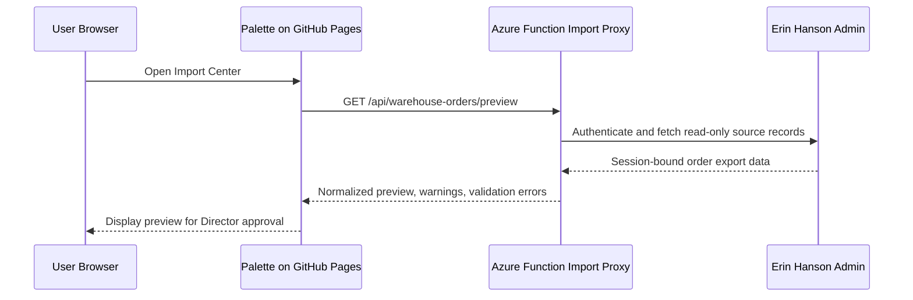

# Secure Order Import

## Overview

Palette stays on GitHub Pages. A separate Azure Functions proxy handles credential-protected access to `admin.erinhanson.com` and returns a read-only, normalized preview payload.

## Flow

## Hosting Options

- Frontend: GitHub Pages
- Proxy: Azure Functions HTTP trigger
- Recommended Azure plan: Consumption or Flex Consumption for the initial secure foundation

## Security Model

- Frontend configuration may only use public values such as `VITE_WEBSITE_IMPORT_PROXY_URL`.
- Server-side secrets stay in Azure environment variables only.
- The proxy never returns usernames, passwords, cookies, bearer tokens, raw upstream headers, or raw authentication responses.
- The proxy only returns a normalized preview plus validation metadata.
- No production write or mutation path exists in the foundation.

## Environment Variables

Required server-side secrets:

- `WEBSITE_IMPORT_BASE_URL`
- `WEBSITE_IMPORT_USERNAME`
- `WEBSITE_IMPORT_PASSWORD`

Public frontend setting:

- `VITE_WEBSITE_IMPORT_PROXY_URL`

Optional server-side allowlist configuration:

- `WEBSITE_IMPORT_ALLOWED_ORIGINS`

## Upstream Authentication

The public admin shell indicates a login page with Email and Password fields and Blazor authentication plumbing. The actual transport may be form login with a session cookie, but that mechanism is still unconfirmed. The foundation therefore uses fixture-backed transport and a read-only adapter boundary until the real auth flow is verified manually.

## Preview Before Import

The proxy returns a read-only preview containing:

- source order ID
- order number
- customer
- artwork
- product type
- size
- orientation
- frame
- due date
- fulfillment method
- shipping destination
- notes
- red notes
- validation status
- safe original source fields

Director approval happens after review in Palette. No production records are modified by this foundation.

## CORS

The proxy allows only configured frontend origins. The current allowlist is intended to cover:

- `http://localhost:5173`
- `http://127.0.0.1:5173`
- `https://erramaus.github.io`

No wildcard production CORS policy is used.

## Unresolved Details

- The actual upstream auth mechanism is not yet confirmed.
- The proxy currently uses fixture transport instead of live login automation.
- The production deployment shape should be reviewed before any secret is added to Azure.

## Future Deployment Steps

1. Confirm the actual upstream auth mechanism with a manual browser session.
2. Replace the fixture transport with the real authenticated read-only fetch adapter.
3. Deploy the Azure Function and configure server-side secrets.
4. Point `VITE_WEBSITE_IMPORT_PROXY_URL` at the deployed proxy.
5. Keep the GitHub Pages frontend credential-free.